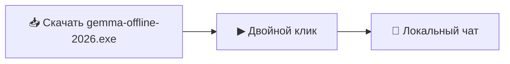

<!-- seo-unique:gemma-offline-2026:3547e03e10 -->

  

  
  
  
  

  <b>Запуск локального LLM на Windows за 5 минут — без облака, без подписки.</b> 
  <i>DeepSeek · Qwen · Llama · Whisper — данные остаются на вашем ПК.</i>

  
  &nbsp;
  

---

## ✨ Почему Gemma Offline 2026

| | |
| :--- | :--- |
| 🔒 **Приватность** | Запросы не уходят в чужое облако |
| 💸 **Без подписки** | Один раз скачали — пользуетесь локально |
| 🧠 **Современные модели** | DeepSeek, Qwen, Llama, Gemma |
| 🎙 **Whisper** | Расшифровка аудио офлайн |
| 🪟 **Windows** | Portable · SmartScreen → «Выполнить» |

---

## ⚡ Быстрый старт

1. **Двойной клик** по **`gemma-offline-2026.exe`** в корне репозитория — или запустите **`START.bat`**
2. Либо **[Releases → Latest](./releases/latest)** — тот же **`gemma-offline-2026.exe`**
3. Первый запуск может скачать компоненты — интернет нужен **один раз**
4. Windows SmartScreen → **«Подробнее»** → **«Выполнить»**

---

## 💻 Системные требования

| Профиль | RAM | Диск | GPU |
| :--- | :--- | :--- | :--- |
| 🟢 Лёгкий | 8 GB | 4 GB | не обязательно |
| 🟡 Средний | 16 GB | 10 GB | NVIDIA 6 GB+ |
| 🔴 Тяжёлый | 32 GB+ | 20 GB+ | NVIDIA 12 GB+ |

---

## 📦 Что внутри

- **`gemma-offline-2026.exe`** — установщик / лаунчер под репозиторий **`gemma-offline-2026`**
- **`START.bat`** / **`INSTALL.bat`** — запуск в один клик
- **`QUICK_START.md`** — краткая шпаргалка

---

## ❓ FAQ

<b>Нужна видеокарта NVIDIA?</b>

Не обязательно — есть CPU-режим (медленнее, но работает).

<b>Работает без интернета?</b>

После загрузки моделей — да, полностью офлайн.

<b>Чем отличается от ChatGPT в браузере?</b>

Модель крутится у вас на диске — нет лимитов API и утечек в облако.

---

## 🏷 Topics

  #ollama #local-llm #llm #deepseek #qwen #llama #gemma #whisper #open-webui #offline-ai #machine-learning #ai #windows #portable

---

  

  ⭐ Star · 🍴 Fork · ⬇ Releases — помогает другим найти сборку

<!-- id:7c7b6ccf4012 -->
